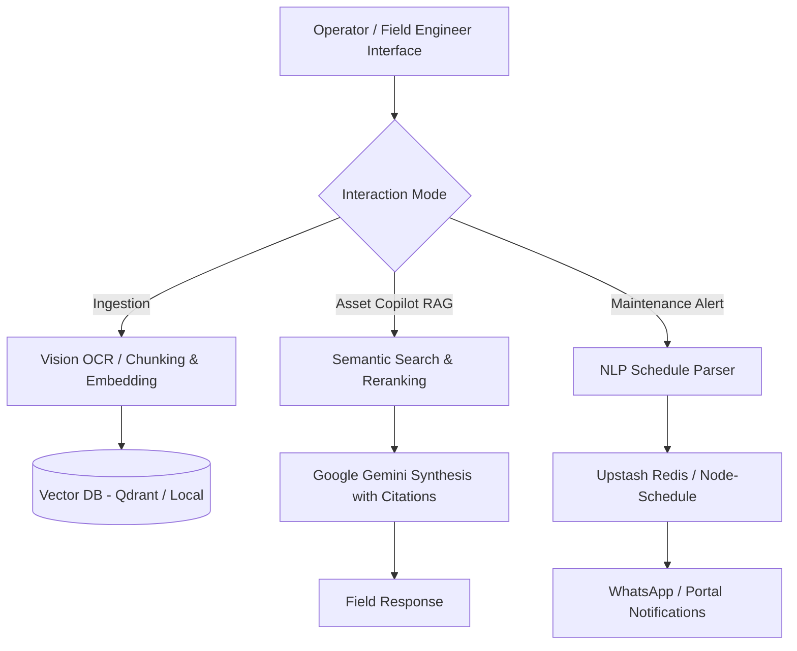

# Industrial Knowledge Intelligence: Unified Asset & Operations Brain

An AI-powered industrial operations platform that unifies heterogeneous plant records—P&IDs, engineering drawings, maintenance logs, operating procedures, and safety compliance manuals—into an actionable, queryable intelligence brain.

---

## 🚀 Key Modules & Features

### 1. Universal Document Ingestion & Knowledge Graph
* Ingests technical documentation (PDFs, scanned equipment datasheets, P&IDs, safety manuals).
* Extracts process metrics, equipment tags, maintenance schedules, and regulatory rules.
* Stores vector embeddings in **Qdrant / ChromaDB** with local offline fallback support.

### 2. Expert Asset Copilot (RAG-Powered)
* Context-aware operational & engineering assistant for field engineers.
* Provides answers complete with **confidence estimations** and **direct source citations**.

### 3. Safety & Regulatory Compliance Engine
* Queries safety regulations (Factory Act, OISD, PESO, environmental norms).
* Offers instant compliance advice and standard operating procedure (SOP) checks.

### 4. Automated Inspection & Maintenance Scheduler
* Parses natural language maintenance requests (e.g., *"Schedule boiler-A inspection weekly at 9am"*).
* Schedules one-time or recurring cron-based inspection notifications.
* Persists schedules using **Upstash Redis** & **node-schedule**.

---

## 🛠 Technical Architecture



---

## 🧰 Technology Stack

| Layer | Technology |
|---|---|
| **Core Server** | Node.js, Express |
| **Messaging** | Twilio WhatsApp API |
| **AI / LLM** | Google Gemini SDK (`@google/genai`), Xenova Transformers |
| **Vector Search** | Qdrant Client / Local File-Based Vector Engine |
| **Job Queue & Storage**| Upstash Redis, Node-Schedule, Firebase Firestore |
| **Frontend** | React, Vite (Cyber-Industrial Modern UI) |

---

## ⚡ Quick Start

1. **Install Dependencies**

```bash
npm install
cd dashboard && npm install && cd ..
```

2. **Configure `.env`**

```env
PORT=3000
GEMINI_API_KEY=<your-key>
QDRANT_URL=<your-qdrant-url>
QDRANT_API_KEY=<your-qdrant-key>
UPSTASH_REDIS_REST_URL=<your-redis-url>
UPSTASH_REDIS_REST_TOKEN=<your-redis-token>
MOCK_WHATSAPP=true
USE_LOCAL_VECTOR_STORE=false
```

3. **Run Backend**

```bash
npm start
```

4. **Run Web Dashboard**

```bash
cd dashboard
npm run dev
```
